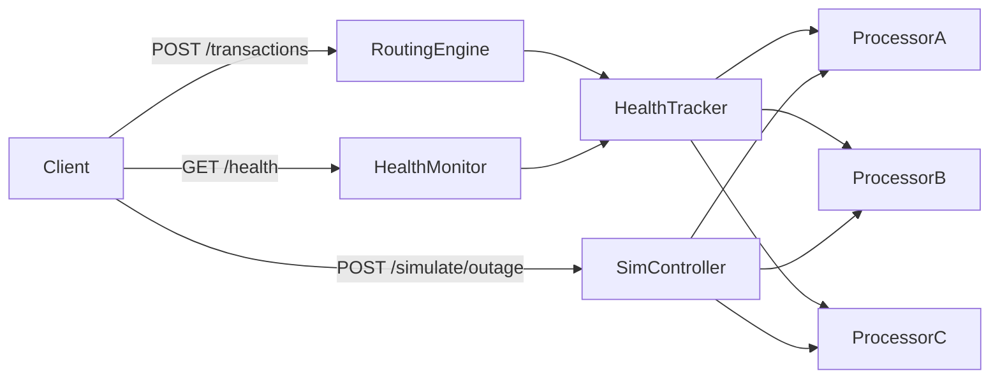

# Smart Payment Routing Engine

## Tech Stack

- **Python 3 + FastAPI** -- fast to build, clean code, auto-generated OpenAPI docs
- **In-memory state** (no database needed)
- **uvicorn** as the server

## Architecture



## Project Structure

```
yuno-ia-challenge/
  app/
    __init__.py
    main.py           # FastAPI app, endpoints
    processors.py     # Mock processor simulators
    router.py         # Routing engine + circuit breaker logic
    health.py         # Health tracker (sliding window)
    models.py         # Pydantic models (request/response)
  test_scenario.py    # Script to demo outage + recovery
  requirements.txt
  README.md
```

---

## DELIVERY 1 -- Minimal Working API

**Goal**: A running server that accepts transactions and routes them to a random mock processor.

**Files created**:
- `requirements.txt` (fastapi, uvicorn, httpx)
- `app/__init__.py`
- `app/models.py` -- Pydantic models for `TransactionRequest` and `TransactionResponse`
- `app/processors.py` -- 3 mock processors (each with name, base success rate, fee). `process()` returns approved/declined via random roll.
- `app/main.py` -- FastAPI app with `POST /transactions` that picks a random processor and returns the result.

**How to manually test**:
```bash
pip install -r requirements.txt
uvicorn app.main:app --reload

# In another terminal:
curl -X POST http://localhost:8000/transactions \
  -H "Content-Type: application/json" \
  -d '{"amount": 25000, "currency": "COP"}'
```

**Expected result**: JSON response with transaction_id, processor used, status (approved/declined), amount, currency.

---

## DELIVERY 2 -- Health Tracking + Smart Routing

**Goal**: Track processor success rates in real-time, implement circuit breaker, and expose health endpoint.

**Files created/modified**:
- `app/health.py` -- `HealthTracker` class with sliding window (last 100 txns per processor). Computes success_rate, determines status (healthy >= 60%, unhealthy < 60%).
- `app/router.py` -- `SmartRouter` that filters to healthy processors, selects lowest-fee among them, falls back to best-of-unhealthy if all are down.
- `app/main.py` -- Updated `POST /transactions` to use SmartRouter. Added `GET /health` endpoint.

**How to manually test**:
```bash
# Send several transactions
for i in $(seq 1 20); do
  curl -s -X POST http://localhost:8000/transactions \
    -H "Content-Type: application/json" \
    -d '{"amount": 15000, "currency": "PEN"}' | python -m json.tool
done

# Check health metrics
curl -s http://localhost:8000/health | python -m json.tool
```

**Expected result**: GET /health returns per-processor metrics (success_rate, status, total_attempts, total_successes). Transactions only route to healthy processors.

---

## DELIVERY 3 -- Outage Simulation, Demo Script, and Unit Tests

**Goal**: Add simulation controls, a demo script for the full failover lifecycle, and unit tests for deterministic validation of routing logic.

**Files created/modified**:
- `app/main.py` -- Added `POST /simulate/outage/{processor_id}` (drops success rate to 10%) and `POST /simulate/recover/{processor_id}` (restores original rate). Also added `POST /simulate/reset` to clear all health data.
- `test_scenario.py` -- Automated script that:
  1. Sends 80 transactions (all processors healthy)
  2. Triggers outage on processor_a
  3. Sends 80 more transactions (traffic shifts away)
  4. Recovers processor_a
  5. Sends 80 more transactions (traffic returns)
  6. Prints per-phase summary with processor distribution
- `tests/test_health.py` -- Unit tests for the health tracker:
  - Success rate calculation with known inputs
  - Status transitions (healthy -> unhealthy -> healthy)
  - Sliding window eviction (old results drop off)
  - Registry reset
- `tests/test_router.py` -- Unit tests for the smart router:
  - Cost-aware selection (cheapest healthy processor picked)
  - Circuit breaker exclusion (unhealthy processors skipped)
  - Probe mechanism (unhealthy processors get probed every Nth transaction)
  - Fallback behavior (all unhealthy -> pick best success rate)
  - Auto-recovery (processor crosses back above threshold)

**How to manually test**:
```bash
# Run unit tests:
python -m pytest tests/ -v

# Start server, then run scenario:
python test_scenario.py

# Or test manually:
curl -X POST http://localhost:8000/simulate/outage/processor_a
# send some transactions, check /health
curl -X POST http://localhost:8000/simulate/recover/processor_a
```

**Expected result**: All unit tests pass. Demo script prints clear output showing traffic shifting away from the failing processor and back after recovery.

---

## DELIVERY 4 -- Documentation

**Goal**: Complete README with everything a reviewer needs.

**File created**:
- `README.md` covering:
  - Project overview and problem context
  - How to run (pip install + uvicorn)
  - API reference with example curl commands and responses
  - Routing algorithm explanation (sliding window, circuit breaker, cost tiebreaker)
  - Design decisions and trade-offs
  - How to run the demo scenario

---

## Key Design Decisions

- **Sliding window (last 100 txns)** vs time-based -- simpler, deterministic, no clock dependency
- **60% health threshold** -- configurable, matches challenge requirement
- **Cost-aware tiebreaker** -- among equally healthy processors, prefer the cheapest
- **In-memory state** -- acceptable for prototype, no external dependencies
- **Fallback routing** -- if all processors are unhealthy, use the one with highest success rate rather than rejecting everything

